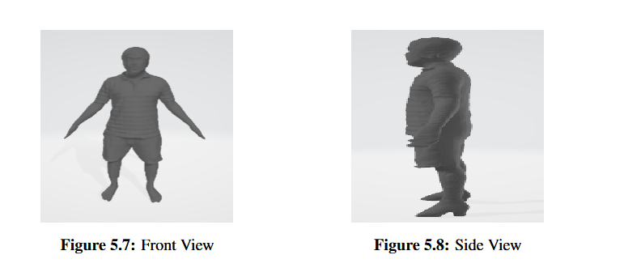

# Smart Fit (Final year research project)

This project presents a comprehensive approach to accurate human body measurements and shirt size prediction using Keypoints Detection, pixel estimation, 3D reconstruction, and regression modeling. By integrating these techniques, the solution aims to enhance customer satisfaction in fashion, e-commerce, and healthcare by providing precise body measurements and personalized shirt size recommendations. The methodology is evaluated using a dataset of body measurements and shirt sizes, with a focus on predicting size categories.

## Features

- **Body Measurement Extraction**:
  - Linear measurements (e.g., shoulder width, shirt length) using MediaPipe keypoint detection.
    - 

  - Circular measurements (e.g., chest circumference) using 3D body reconstruction with the Human Mesh Recovery (HMR) model.
    - 

- **Shirt Size Prediction**:
  - Employs regression and classification models trained on body measurements to predict shirt size categories (S, M, L) tailored to different brands.

    

- **Cross-Platform Mobile App**:
  - Developed using Flutter, compatible with Android and iOS devices.

## System Architecture

1. **User Input**: Height and a single full-body image captured through the app.
2. **Image Segmentation**: Uses TensorFlow DeepLabV3+ to separate the user’s body from the background.
3. **Keypoint Detection**: Identifies key landmarks on the body for linear measurements.
4. **Pixel-to-Centimeter Conversion**: Calculates a pixel ratio using user height for accurate scaling.
5. **3D Reconstruction**: Builds a 3D mesh of the body for circular measurements.
6. **Shirt Size Prediction**: Machine learning models predict shirt sizes based on extracted measurements.

## Technologies Used

- **Frontend**: Flutter for mobile app development.
- **Backend**: Python Flask server.
- **Machine Learning**: Scikit-learn for training regression and classification models.
- **Computer Vision**:
  - TensorFlow DeepLabV3+ for segmentation.
  - MediaPipe for keypoint detection.
  - HMR (Human Mesh Recovery) for 3D modeling.

## Results and Achievements

- Achieved a **97.4% segmentation accuracy** using DeepLabV3+.
- Ensemble learning models delivered the **highest accuracy** for shirt size prediction.
- User-friendly mobile interface for inputting height and images, providing real-time AR-based fitting.

## How to Use

1. **Download and Open the App**:
   - Install the Smart Fit app on your Android or iOS device.
2. **Enter Your Details**:
   - Input your height in centimeters.
3. **Capture Your Image**:
   - Take a full-body image using the in-app camera.
4. **View Measurements and Sizes**:
   - Get precise body measurements and size recommendations for various brands.

## Future Enhancements

- **Dataset Expansion**: Increase data diversity to improve generalization.
- **Real-Time Applications**: Enable live video-based measurements.
- **Enhanced Measurements**: Add more dimensions like inseam and arm length.
- **Industry Collaboration**: Validate the system with real-world retail scenarios.
- **Advanced Models**: Integrate deep learning techniques for improved predictions.

## Contribution

Feel free to contribute to the project by suggesting features, reporting issues, or enhancing the codebase. We welcome collaborations to further develop Smart Fit.

---

### Acknowledgments

Special thanks to Amrita School of Computing for the support and guidance during the development of this project.

---
